<!-- 
Title: Decaf Doug
Description: A webpage about decaf coffee, because coffee lovers have to drink decaf sometimes
Image: http://i.imgur.com/jejxCJZ.jpg
URL: http://www.decafdoug.com
Twitter Title: Decaf Doug.com
Twitter Description: A webpage about decaf coffee, because coffee lovers have to drink decaf sometimes
Twitter Image: http://i.imgur.com/jejxCJZ.jpg
Twitter Card Type: summary_large_image
-->

<!-- 
Styles: 
- http://fonts.googleapis.com/css?family=Oswald|Montserrat
- https://fonts.googleapis.com/icon?family=Material+Icons

Scripts:
- //pagead2.googlesyndication.com/pagead/js/adsbygoogle.js
-->

    <h1 style="font-family: 'cursive';">
        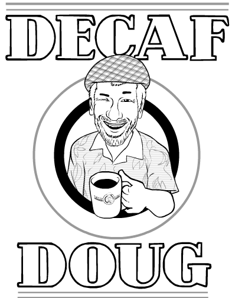 
        Decaf Doug 
        
    </h1>

[About](AboutUs.html)

---

     
     
    

---

## **[Carmelo's](http://www.carmelos.com/Site/home.html)**

[*238 Snelling Ave S, St Paul, MN 55105*](https://goo.gl/maps/V9nXjNRneRG2)

**Flavor 
 ☕️
 ☕️
 ☕️** 

**Temperature 
 ☕️
 ☕️
 ☕️** 

**Refill Frequency 
 ☕️
 ☕️
 ☕️** 

**Price 
 💲💲 💲** 

    

 
We went to [Carmelo's Ristorante](http://www.carmelos.com/Site/home.html) here is St. Paul and we went with fellow coffee bloggers [Kinda Different](https://kindadifferent.net/wp/). 
 So the restaurant has a European feel to it, with lots of photos of Italian scenery. 
 And the decaf had a European flavor to it. 
 Very distinct flavor, it was really good.

So we'd give it a number 4. 
 It was hot, so a number 4 for that one too. 
 For refills we'd give it a number 4 and for price it was only $1.95. 
 The link to Carmelo's, is [carmelos.com](http://www.carmelos.com/Site/home.html) but link for another great coffee blog is [kindadifferent.net](https://kindadifferent.net/wp/).

---

This is Arial font.

This is Times New Roman font.

This is Courier New font.

This is Georgia font.

This is Palatino Linotype font.

This is Tahoma font.

This is Trebuchet MS font.

This is Verdana font.

This is Lucida Console font.

This is Lucida Sans Unicode font.

This is Comic Sans MS font.

This is Impact font.

This is Arial Black font.

---

# One
## Two
### Three
#### Four
##### Five

---

## **[Chanhassen Dinner Theatres](https://www.chanhassendt.com/)**

[*501 W 78th St, Chanhassen, MN 55317*](https://goo.gl/maps/U81suzw484N2)

**Flavor 
 ☕️
 ☕️ 
 ☕️ 
 ☕️** 

**Temperature 
 ☕️
 ☕️☕️** 

**Refill Frequency 
 ☕️
 ☕️☕️** 

**Price 
 💲 💲 💲** 

 

    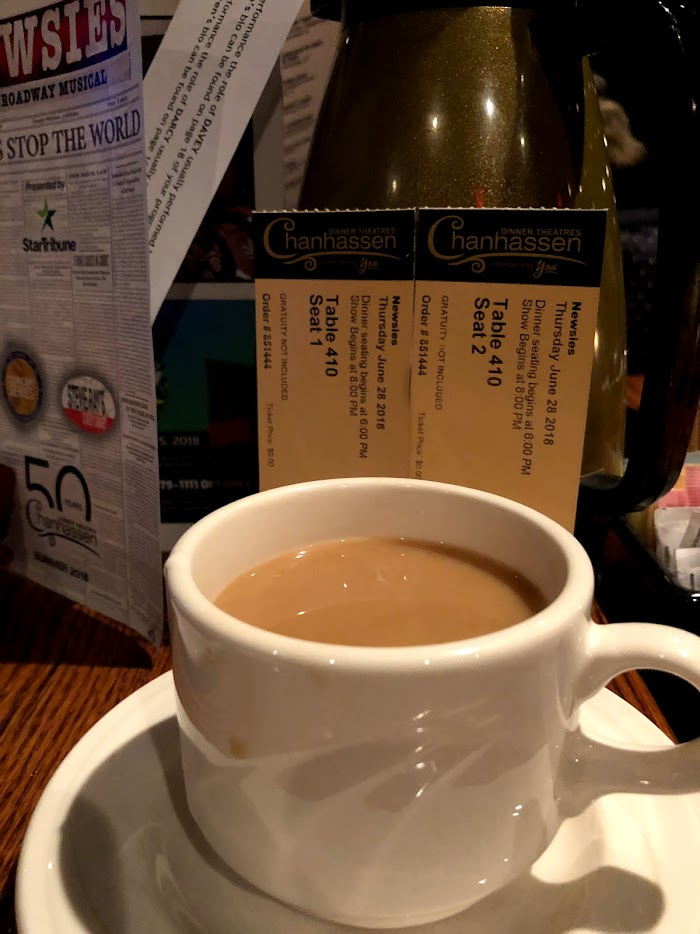

 
We went to the [Chanhassen](https://www.chanhassendt.com/) dinner theater to see the show [Newsies](https://www.chanhassendt.com/Online/default.asp?BOparam::WScontent::loadArticle::permalink=newsies&BOparam::WScontent::loadArticle::context_id=), it was a really good show, and the coffee service was **super**!

So I got my decaf right away and it was hot. 
 The flavor was okay, a number 3. 
 But the incredible thing is that I had coffee with dinner then, at intermission, they brought a *fresh pot of coffee*! 
 It was great. 
 I was just thinking that I could use another a cup of coffee during intermission and then there she was, a whole pot. 
 It was tremendous. 
 The other thing was the coffee was included with the meal, there was no extra charge for all of that coffee. 
 So if you are a coffee drinker like I am, the Chanhassen is a great place to go for a show. 
 And they did a great job with the production of [Newsies](https://www.chanhassendt.com/Online/default.asp?BOparam::WScontent::loadArticle::permalink=newsies&BOparam::WScontent::loadArticle::context_id=).
 
---

## **[Carbone's Pizza](http://carbonesonrandolph.com/)**

[*1698 Randolph Ave, St Paul, MN 55105*](https://goo.gl/maps/HYstmmJPsiz)

**Flavor 
 ☕️
 ☕️ 
 ☕️ 
 ☕️** 

**Temperature 
 ☕️
 ☕️
 ☕️** 

**Refill Frequency 
 ☕️
 ☕️ 
 ☕️ 
 ☕️** 

**Price 
 💲
 💲 
 💲** 

    

 
We went to [Carbone's](http://carbonesonrandolph.com/carbonesonrandolph/HOME.html). 
 Of course you have to have coffee with pizza too right. 
 I ordered a decaf and they made a fresh pot for me, so it was really hot. 
 Like a number 5. 
 And the flavor was alright, it was a number 3. 
 For refills I'd have to give them a number 3 for that too, because I had to ask a couple of times. 
 But the price was really good, it was only $1.50. 
 So we'll give them a 1 and a half for that ( ;) ). 
 The only thing is they have powdered creamers. 
 I don't really care for that too much. 
 But it worked out okay.

They have really good pizza there at [Carbone's](http://carbonesonrandolph.com/carbonesonrandolph/HOME.html). It's the one in St. Paul on Randolph. 
 It's been there since the 50's. 
 And the kids always liked that pizza too. 
 It is a thin crust and they cut it in squares. 
 So we really like the pizza there. 
 And the decaf? 
 Well it was okay.

---

## **[Fabulous Fern's](http://www.fabulousferns.com/)**

[*PERMANENTLY CLOSED*](https://goo.gl/maps/DYUfsL5wkws)

**Flavor 
 ☕️
 ☕️
 ☕️** 

**Temperature 
 ☕️
 ☕️
 ☕️** 

**Refill Frequency 
 ☕️
 ☕️ ☕️ ☕️** 

**Price 
 💲💲💲** 

 

    

 
We went to [Fabulous Fern's](http://www.fabulousferns.com/) on [Selby Avenue](https://goo.gl/maps/DYUfsL5wkws). 
 We had a big group group, like a dozen people. 
 And they do a great job with big groups. 
 We've done that before a couple of times. 
 They do have the 18% gratuity for 8 or more people, but they have lots of room. 
 They have a big dining area, great french fries, and really good desserts too. 
 But I'm here to talk about the coffee.

So the decaf coffee was really hot. 
 It was a number 5. 
 It had a pretty good flavor. 
 A number 4. 
 And for refills, I'm only going to give them a 3, because I had to ask for refills a couple of times. 
 The price was $2.95, so we'll give them a 2.95.
 So I guess we'll give them 3 dollar signs on that one.

As a sad update, Fabulous Fern's is now permanently closed. 
 I can't believe they are closed because it was always busy. 
 I hope my #3 refill rating wasn't part of their downfall. 
 We will have to find a new place for our group. 
 
---

## **[Applebee's Neighborhood Grill + Bar](https://www.applebees.com/en)**

[*1335 Town Centre Dr, Eagan, MN 55123, USA*](https://goo.gl/maps/WTNjSpWVqrS2)

**Flavor 
 ☕️
 ☕️ 
 ☕️ 
 ☕️** 

**Temperature 
 ☕️
 ☕️
 ☕️** 

**Refill Frequency 
 ☕️
 ☕️
 ☕️** 

**Price 
 💲
 💲
 💲** 

    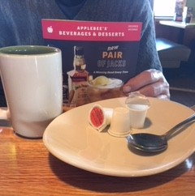

 
We went to [Applebee's](https://www.applebees.com/en), the one in [Eagan](https://goo.gl/maps/WTNjSpWVqrS2), there are a lot of Applebee's around lately. 
 So I ordered my decaf. They made me a fresh pot. 
 They had a nice ceramic mug and a nice presentation, with the creamers and spoon on a little plate.

It was really hot. 
 And the flavor, well, it was average. Like a #3. 
 For the refills I'd give them a #4, they were really good about that and they brought a fresh mug out every time. 
 So they didn't bring a pot and fill your mug, they'd just bring another mug of coffee out. 
 The price was $2.39, so we'll give that a 2. 
 It's always nice to have a fresh pot of hot, fresh decaf with your dinner.

---

## **[Cherokee Tavern](http://cherokeetavern.com/)**

[*886 Smith Ave S, West St Paul, MN 55118*](https://goo.gl/maps/Uv5yQn2MdX72)

**Flavor 
 ☕️
 ☕️
 ☕️** 

**Temperature 
 ☕️
 ☕️
 ☕️** 

**Refill Frequency 
 ☕️
 ☕️ 
 ☕️ 
 ☕️** 

**Price 
 💲
 💲
 💲** 

    

 
 The [Cherokee Tavern](http://cherokeetavern.com/). 
 I went there on the week of my birthday because on Thursday on the week of your birthday you get a *free* steak dinner at a $20 value (!) 
 I ordered my decaf coffee and it was pretty good. 
 It was a number 4 for flavor and the temperature was a number 4. 
 It could have been a little hotter. Could have been better with the refills. 
 Although, he did make me a fresh pot of coffee, so that was great. 
 But for the refills I still have to give him a 3 for the frequency. 
 The price was $2.75, so that would be a $$ for the price.
 
 Also for your birthday you get a little piece of cake for dessert. 
 It's kind of neat, they write "Happy Birthday" in chocolate sauce on your plate. 
 That's when I had my fresh pot of coffee, at the end with my cake. 
 It was really good.
 
---

## **[Valley Natural Foods](https://www.valleynaturalfoods.com/)**

[*13750 Co Rd 11, Burnsville, MN 55337*](https://goo.gl/maps/TH6Wrmx3NqS2)

**Flavor 
 ☕️
 ☕️
 ☕️** 

**Temperature 
 ☕️
 ☕️
 ☕️** 

**Price 
 💲
 💲
 💲** 

    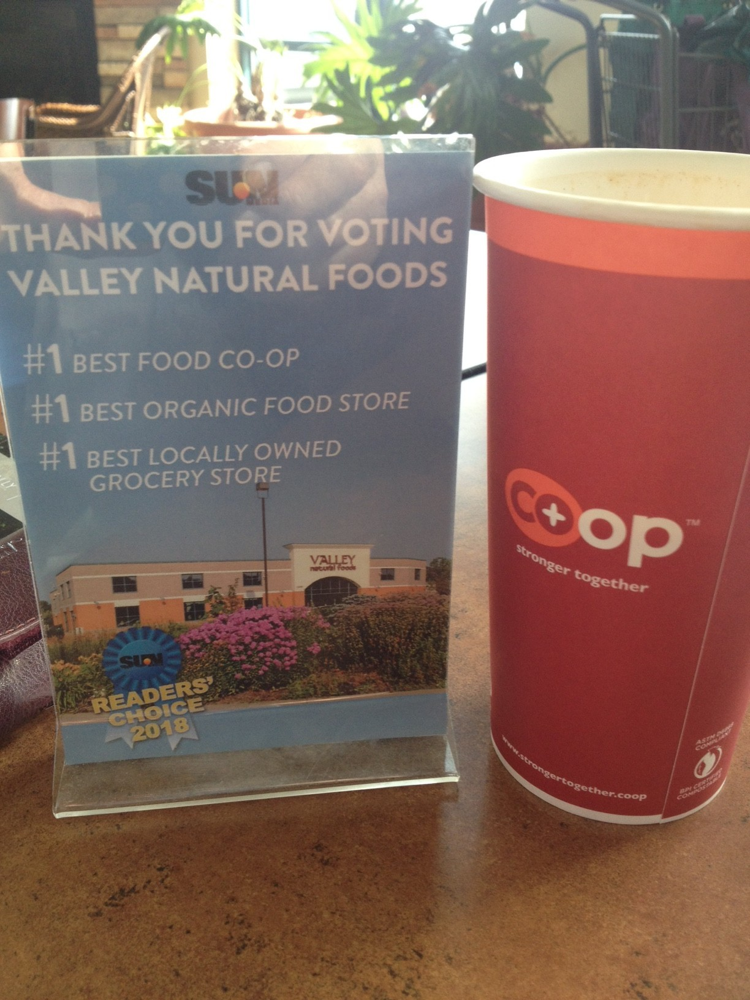

 
We went to [Valley Natural Foods](https://www.valleynaturalfoods.com/) in Burnsville. 
 So they are the food co-op for the South metro. 
 I heard that they have the "*best*" decaf, so I had to go check it out.
 And I must admit, it was pretty good.
 I had an Americano and the large was only $2.50, so I thought that was a pretty good deal. 
 It was very hot, a number 5, and yeah, pretty good, so a number 4.

It was a nice spot in the front of the store with tables, chairs, and a lot of natural light. 
 They have a lot of windows and the sun was out.
 Of course it was a cold day, but it was nice and sunny having our coffee inside. 
 I'm not sure what the coffee was, but the cream was an organic cream. 
 It is a place that promotes eating healthy and community. 
 They have a lot of things going on there about organic foods, eating healthy, classes, and things like that. 
 And there are no refills, so we can't give them a score for refills, but it was very good coffee.

---

## **[Agra Culture Kitchen & Press](http://agra-culture.com/)**

[*721 Cleveland Ave S, St Paul, MN 55116*](https://goo.gl/maps/JHrRbiQnmZM2)

**Flavor 
 ☕️
 ☕️ 
 ☕️ ☕️** 

**Temperature 
 ☕️
 ☕️
 ☕️** 

**Refill Frequency 
 ☕️ 
 ☕️ 
 ☕️ 
 ☕️ 
 ☕️** 

**Price 
 💲
 💲
 💲** 

    

 
 There's a new restaurant in Highland, [Agra Culture](http://agra-culture.com/), on [Cleveland and Highland Parkway](https://goo.gl/maps/JHrRbiQnmZM2). 
 Great. 
 Place. 
 All of their booths have plug-ins for your electronics, it's pretty neat.

 So with my food I ordered decaf and they made me an Americano. 
 It was really hot, a number 5, but the flavor, well, it was like a 3 and 1/2. 
 It seemed a little watered down and it was $3 so that would give it a #3 on the price. 
 And for refills, they didn't have any refills but they had their regular coffee out, a light roast and a dark roast in an airpot (SP?), so I had refills of *regular* coffee. 
 So on refills for the decaf we'd have to just give them a number 1.
 
---

## **[Louisiana Cafe](http://newlouisianacafe.com/)**

[*613 Selby Ave, St Paul, MN 55102*](https://goo.gl/maps/1vQkrKnLFwT2)

**Flavor 
 ☕️
 ☕️ 
 ☕️ ☕️** 

**Temperature 
 ☕️
 ☕️
 ☕️** 

**Refill Frequency 
 ☕️
 ☕️
 ☕️** 

**Price 
 💲
 💲
 💲** 

 

    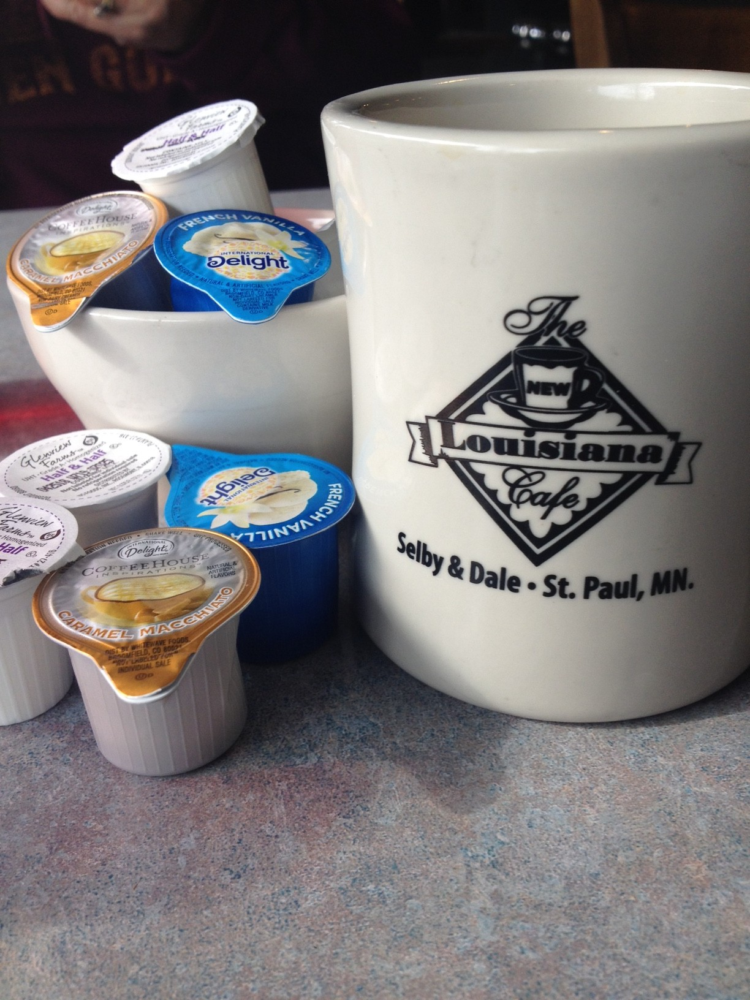

 
 We went to the [Louisiana Cafe](http://newlouisianacafe.com/) on Selby Avenue. 
 They have the same menu as the [Grandview Grill](http://www.grandview-grill.com/menu.html), except their specials are different. 
 They have a little more cajun feel to their specials. 
 They serve [Morningstar coffee](https://morningstarcoffee.com/), they have a nice sized mug which I like, and it was $2.75 so we'll have to give it a 2 for the price. 
 The temperature was hot, like a number 5, but the flavor was only average, like a 3. 
 But they did have a really good flavored creamer, [caramel macchiato](https://www.amazon.com/gp/product/B008R3MSNE/ref=as_li_tl?ie=UTF8&camp=1789&creative=9325&creativeASIN=B008R3MSNE&linkCode=as2&tag=talker90-20&linkId=bc3808eb4a8bb0171f8fa89a7431a7f6)

---

## **[Highland Cafe & Bakery](http://www.highlandcafeandbakery.com/)**

[*2012 Ford Pkwy, St Paul, MN 55116*](https://goo.gl/maps/xPFmL17VDp72)

**Flavor 
 ☕️
 ☕️ 
 ☕️ 
 ☕️** 

**Temperature 
 ☕️
 ☕️
 ☕️** 

**Refill Frequency 
 ☕️
 ☕️
 ☕️** 

**Price 
 💲
 💲
 💲** 

    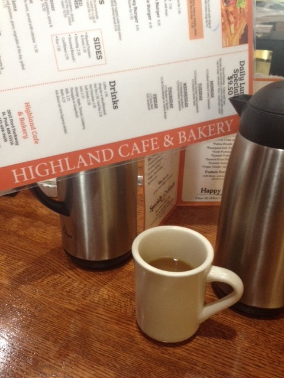

 
 We went to the [Highland Cafe and Bakery](http://www.highlandcafeandbakery.com/) and the coffee was really hot. 
 They had this great thermo-karaf, so I'd have to give their temperature a number 5. 
 Because I got a whole karaf of coffee, I have to give the refills a number 5 as well. 
 However, the flavor was only a number 2, so luckily there was regular coffee there too. 
 Although the half-caff was good, the decaf was only a number 2 for flavor and it was $2.50 so it'd be a number 2.5 for price. 
 We usually go there for brunch or breakfast, but it's also a really good place for lunch or dinner too so we've done that a few times. 
 They have a lot of really good bakery stuff too. 
 They bake it right there and they have all kinds of pies, cakes, caramel rolls, and cinnamon rolls. 
 So, it's a good place to go but make sure when you order the decaf, somebody else orders the regular coffee so that you get a really good cup of coffee.
 
---

## **[Kafe 421](http://www.kafe421.com/)**

[*421 14th Ave SE, Minneapolis, MN 55414*](https://goo.gl/maps/Uba9MznoMZC2)

**Flavor 
 ☕️
 ☕️ 
 ☕️ ☕️** 

**Temperature 
 ☕️
 ☕️ 
 ☕️ ☕️** 

**Refill Frequency 
 ☕️
 ☕️
 ☕️** 

**Price 
 💲
 💲
 💲** 

    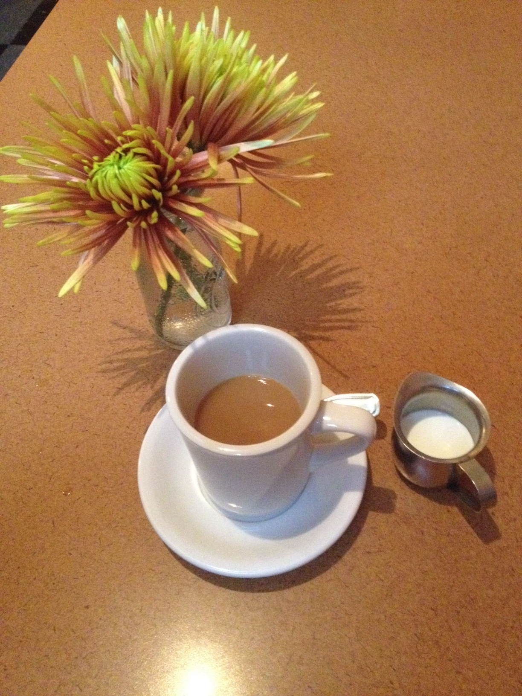

 
 We were in of the [University of Minnesota](https://twin-cities.umn.edu/) area so we stopped at [Kafe, with a "K," 421](http://www.kafe421.com/).
 It's in [Dinkytown](http://dinkytownusa.org/) actually.
 It's a very nice restaurant and we wanted to stop there to celebrate an academic achievement, so that was pretty neat.
 As the decaf coffee, hmm, the best thing about it is that they are really good on the refills.
 So I'd give them a number 5 for that.
 For flavor, it was a 3, so I guess it was about average.
 But then it wasn't that hot, so I'd have to give it a 3 on temperature.
 And 2 for the price because it was $2.50.
 So it was a nice place to go for a celebration but the coffee wasn't the best, but the refill service was fantastic.
 
---

## **[Augustine's Bar & Bakery](http://augustinesmn.com/)**

[*1668 Selby Ave, St Paul, MN 55104*](https://goo.gl/maps/e2XJEND9dCQ2)

**Flavor 
 ☕️
 ☕️
 ☕️** 

**Temperature 
 ☕️
 ☕️
 ☕️** 

**Refill Frequency 
 ☕️
 ☕️
 ☕️** 

**Price 
 💲
 💲
 💲** 

    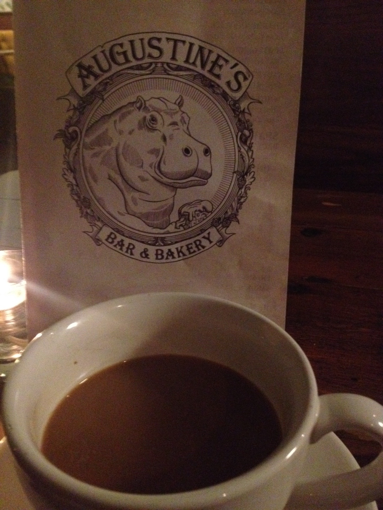

 
 We stopped at [Augustine's Bar & Bakery](http://augustinesmn.com/) last night for dinner.
 It was kind of a late dinner but there were still a few tables there.
 It's over on Selby avenue and it used to be laundry mat but they've transformed it into a great restaurant.
 So we ordered our dinner and I ordered my decaf coffee.
 She said she would make it an americano (!)
 I guess they have a different coffee service there.
 The flavor was good, it was fresh coffee, and it was nice and hot. 
 Wo we'll have to give it a 5 for flavor and a 4 for temperature.
 And for *refills*, they offered me a refill on my americano which was great for me.
 When I was there once before, they made a pot of decaf for me when I asked about refills.
 So I'd have to give them a 5 for refils because they are going above and beyond the call of duty to make sure that I had a refil on my coffee.
 As for price, it is a number 3 because it's $3 coffee.
 
---

## **[Lucky's 13 Pub](http://www.luckys13pub.com/)**

[*2033 Burnsville Center, Burnsville, MN 55306*](https://goo.gl/maps/MReEQDo17yQ2)

**Flavor 
 ☕️
 ☕️
 ☕️** 

**Temperature 
 ☕️
 ☕️
 ☕️** 

**Refill Frequency 
 ☕️
 ☕️
 ☕️** 

    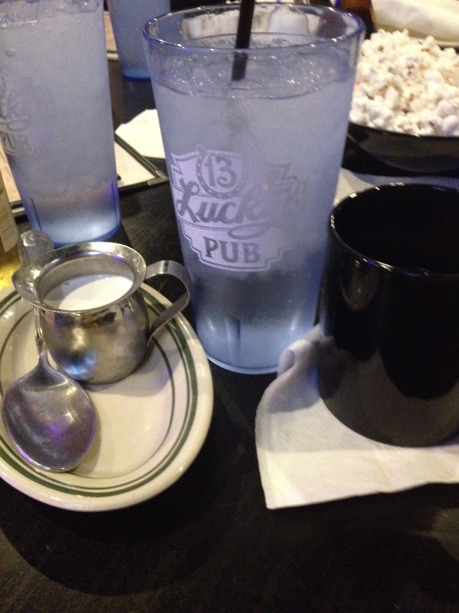

 
 We went to the cousins' lunch today and we went to [Lucky's](http://www.luckys13pub.com/) 13 in Burnsville.
 And the decaf was good.
 I'd say, I was debating between a 3 and 4, but I guess we'll go with a 4 on that one.
 And it was hot.
 For the refills, they always brought a new mug out. Which, I don't know, was kinda neat.
 Instead of bringing a pot of coffee, they'd brought a fresh mug out for you.
 As for refills, it wasn't the best. You always had to ask or refills, but I did have enough.
 So I guess we could give them a 4 on that one too.
 And they also have their breakfast specials go until1 o'clock on the weekends.
 So some people had lunch and some people had breakfast.
 They had some really neat breakfast specials.
 And of course, it's always good to get together and talk about the good old days over a cup of coffee and breakfast or lunch.
 
---

## **[Peace Coffee](https://www.peacecoffee.com/)**

[*3262 Minnehaha Ave, Minneapolis, MN 55406*](https://goo.gl/maps/jrLhDdy5Aqx)

**Flavor 
 ☕️
 ☕️
 ☕️** 

**Temperature 
 ☕️
 ☕️
 ☕️** 

    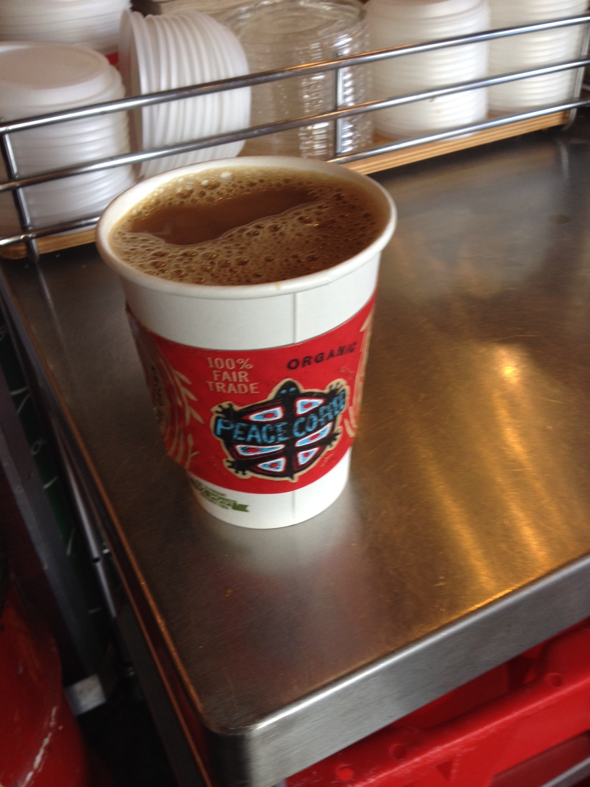

 
 Stopped at [Peace Coffee](https://www.peacecoffee.com/) today for *free* coffee. I got a coupon from the [Chinook Book](https://chinookbook.com/minneapolis-st-paul), a coupon book where you can get all kinds of things when you buy the book.
 And the coffee was *fantastic.*
 It was really hot.
 I had to put a sleeve on my cup it was so hot.
 And the flavor was good.
 They called it "blanched almond and golden raisin". 
 That may be a little dramatic, but it did have really good flavor.
 So I'd definitely have to give the flavor a 5 and a 5 for temperature.
 You'll have to check on the price when you go, I got mine for free.
 One suggestion for improvement, they didn't have the decaf server labelled so the barista had to help.
 
---

## **[Lindey's Prime Steak House](http://www.theplaceforsteak.com/)**

[*3600 Snelling Ave N, Arden Hills, MN 55112*](https://www.google.com/maps/place/Lindey's+Prime+Steak+House/@45.0505438,-93.1653263,17z/data=!3m1!4b1!4m5!3m4!1s0x52b32914af80af79:0x5c13deaa975f34d8!8m2!3d45.0505438!4d-93.1631376)

**Flavor 
 ☕️
 ☕️ 
 ☕️ ☕️** 

**Temperature 
 ☕️
 ☕️
 ☕️** 

**Refill Frequency 
 ☕️
 ☕️
 ☕️** 

**Price 
 💲
 💲
 💲** 

    

 
 A real steak house: they have 4 menu items and 3 of them are steak. The other one is shrimp. You get potato, salad, and bread with your steak dinner (unless you want the shrimp of course).
 
 I got the decaf coffee and it was really hot, so a number 5 on that one.
 And they kept it full. They brought me a pot and then they brought me *another* pot.
 The flavor was okay, so that'd be a 3.
 And for the price I'd give it a 2.95 ;) It was $2.95 for the coffee.
 
It said 
 [Folgers](https://www.amazon.com/gp/product/B010ULFNW8/ref=as_li_tl?ie=UTF8&camp=1789&creative=9325&creativeASIN=B010ULFNW8&linkCode=as2&tag=talker90-20&linkId=c7e0b3ce264e5bb9d551b6fd567c2f50)

 They do have a [birthday club](http://theplaceforsteak.com/birthday-club.html) there too, so I would sign up for that.
 Then you can get a steak dinner for free if you get one that's a certain price, or you get a certain amount off on your bill.
 So that's a pretty good way to celebrate your birthday:
 a steak dinner and a pot of decaf coffee.

---

**Grandview Grill**

*1818 Grand Ave, St Paul, MN 55105*

**Flavor 
 ☕️
 ☕️ 
 ☕️ 
 ☕️** 

**Temperature 
 ☕️
 ☕️
 ☕️** 

**Refill Frequency 
 ☕️
 ☕️
 ☕️** 

**Price 
 💲
 💲
 💲** 

    

 
 So the Grandview Grill has [Morningstar Coffee](https://morningstarcoffee.com/) and it is $2.75 so I guess that would be a high 2.
 The regular coffee was good, but the decaf was only so-so, a little weak.
 But it was nice and hot, like a number 4.
 And the refill service was *excellent*, so I'd have to give that a number 5.
 They didn't give us a pot of coffee, but the waitress was already right there whenever you needed more coffee.
 
 ---
 
 ## **[Neighborhood Cafe](http://www.theneighborhoodcafemn.com/)**

*1570 Selby Ave, St Paul, MN 55104*

**Flavor 
 ☕️
 ☕️
 ☕️** 

**Temperature 
 ☕️
 ☕️
 ☕️** 

**Refill Frequency 
 ☕️
 ☕️
 ☕️** 

**Price 
 💲
 💲
 💲** 

    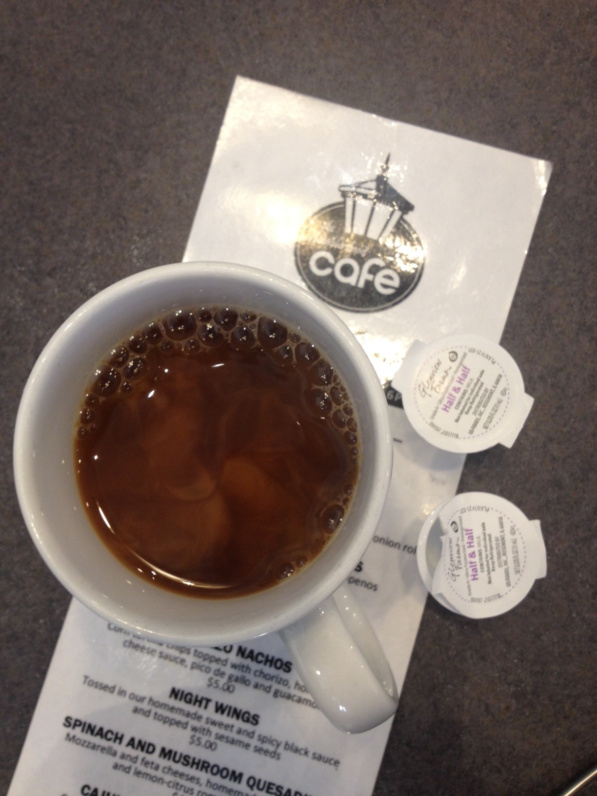

 
 The [Neighborhood Cafe](http://www.theneighborhoodcafemn.com/). 
 The flavor was a 3, no, we'll go for 4. 
 The coffee was really hot, so I would say it was a 4 for the temperature. 
 Also it's hard to find a parking spot over there on Selby and Snelling. 
 So what we did is drop somebody off and they go to get the table while you park the car. 
 So that was the only bad thing about the [Neighborhood Cafe](http://www.theneighborhoodcafemn.com/) is that it's hard to park. 
 They are really fast. 
 They had my coffee at the table right away. 
 When she came back to check on us, I asked for the refills. 
 And we had a couple of "farmer's breakfasts," which are a really good deal. 
 So it was a great experience at the [Neighborhood Cafe](http://www.theneighborhoodcafemn.com/)

 I have a [Neighborhood Cafe](http://www.theneighborhoodcafemn.com/) update: 
 I found out they use [Dunn Brother's Coffee](https://www.amazon.com/gp/product/B00R1V54NY/ref=as_li_tl?ie=UTF8&camp=1789&creative=9325&creativeASIN=B00R1V54NY&linkCode=as2&tag=talker90-20&linkId=52f08c8f992af54cba19d2228d53291e) which is roasted like 3 blocks away from the restaurant, so that's why their coffee is so good!
 
---

## **[Salsa a la Salsa](https://www.salsaalasalsa.com/)**

*1420 Nicollet Ave, Minneapolis, MN 55403*

**Flavor 
 ☕️
 ☕️
 ☕️** 

**Temperature 
 ☕️
 ☕️
 ☕️** 

**Refill Frequency 
 ☕️
 ☕️
 ☕️** 

**Price 
 💲
 💲
 💲** 

    

 
 We went to [Salsa a la Salsa](https://www.salsaalasalsa.com/) which is in the Midtown Global Market. 
 The coffee was *super*! 
 They had a nice cup too :) I like their mugs. 
 They were clear, glass mugs that are kind of tall. 
 So the coffee even looks good in it.
 
 They made a fresh pot of decaf for me. 
 It was nice, hot, and fresh. 
 So I'd have to give it number 5 for temperature. 
 The flavor was good so, let's see, we'll give that a number 4 and the price was a number 3 because it was $3 bucks. 
 And then the refills, I'd give that a number 5, they were really good about keeping my cup full. 
 They used to validate parking which was a bonus, however the last time we were there they did not. 
 So that was a plus. 
 So it was good coffee, we had a nice lunch, and free parking so that was super.
 
---

## **[Baker Square](http://www.bakerssquarerestaurants.com)**

*2239 Ford Pkwy, St Paul, MN 55116*

**Flavor 
 ☕️
 ☕️ 
 ☕️ 
 ☕️** 

**Temperature 
 ☕️
 ☕️
 ☕️** 

**Refill Frequency 
 ☕️
 ☕️
 ☕️** 

**Price 
 💲
 💲
 💲** 

    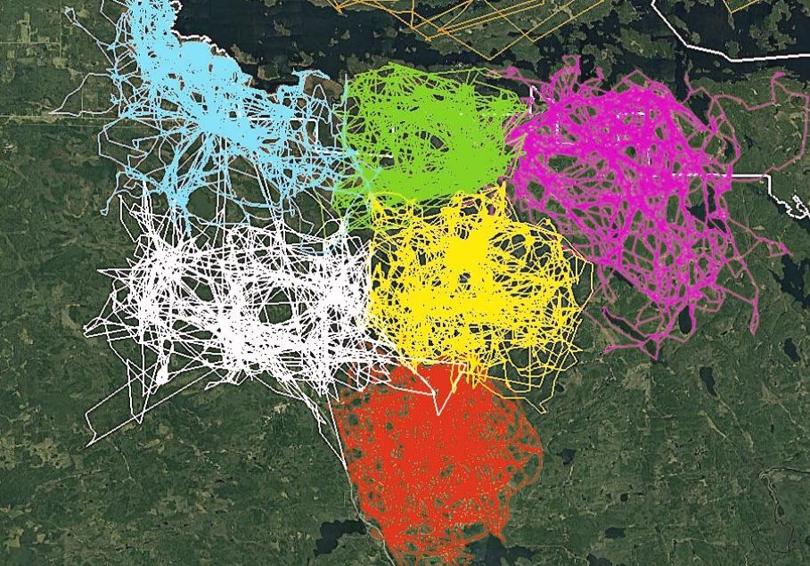

 
 Baker Square coffee!
 We went to Baker Square today. 
 I must say we go to Baker Square quite a bit.
 Because we like breakfast and brunch I guess.
 But their coffee isn't as good as it used to be.
 And my decaf panel of experts agreed with me, that years ago Baker Square coffee was better.
 It lacks flavor.
 So for flavor I would give it a number 2.
 But I will say, they are terrific on refills because they give you a pot of coffee right away.
 The coffee is really hot and the price is reasonable.
 Talk about hot coffee! At Baker Square they even give you a hot *cup*. 
 The last couple of times I stopped there I noticed that the cup is actually hot before you even pour your coffee. 
 What a great idea!
 
 So if they went back to how they brewed in the 90's, I think they'd be all set.
 It seems like they used to grind their beans fresh then. 
 They had a different coffee service in how they had it set up.
 Now, they brew the coffee in the back, they don't have it out by the customers so I can't tell how they do it.
 But it definitely doesn't have the flavor it used to have.
 
Update: I found a new favorite pie to go with my coffee, chocolate hazelnut silk. 
 So this is Decaf Doug ™ from Baker Square.
 We usually go to Highland, but I guess they have a few around.
 Okay! Bye.
 
---

## **[SuperAmerica](http://superamerica.com/StoreHome/4428)**

*232 Fairview Ave S, St Paul, MN 55105*

**Flavor 
 ☕️
 ☕️ 
 ☕️ 
 ☕️** 

**Temperature 
 ☕️
 ☕️
 ☕️** 

**Refill Frequency 
 ☕️
 ☕️ 
 ☕️ 
 ☕️** 

**Price 
 💲
 💲 
 💲** 

 

    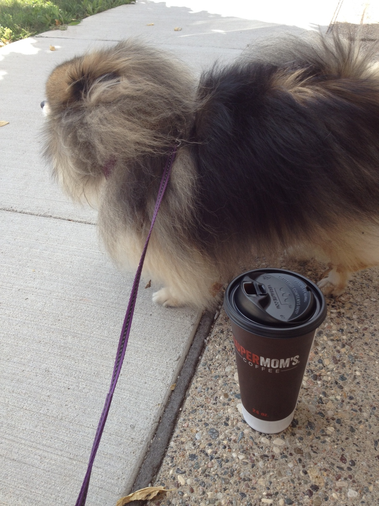

 
 So I went to [SuperAmerica](http://superamerica.com/StoreHome/4428) for coffee and got a free coffee, but they didn't have any decaf!
 So I got the regular Colombian Supremo.
 It was super hot, so I'd have to give it a number 5 for that.
 I had to wait a minute before I could actually start drinking my coffee (!), which is really hot.
 The flavor was okay.
 You don't get a refill, but you get a 24 ounce cup, which is like a half a pot of coffee.
 And then the price was super, because it was free for Coffee Day.
 But it's usually a dollar, 99¢ is what they advertise.
 It was kind of disappointing that they didn't have decaf.
 It's the afternoon so I was really looking forward to drinking decaf.
 So I can't really drink all of my regular coffee.
 So I'll have to pace myself and maybe save some for tomorrow morning.
 
 Happy Coffee Day!
 
---

 ## **[Holiday Stationstores](http://www.mallofamerica.com/shopping/directory/holiday-station-store)**

*123 West Market, Bloomington, MN 55425*

**Flavor 
 ☕️
 ☕️ 
 ☕️ 
 ☕️** 

**Temperature 
 ☕️
 ☕️
 ☕️** 

**Refill Frequency 
 ☕️ 
 ☕️ 
 ☕️ 
 ☕️ 
 ☕️** 

**Price 
 💲
 💲 
 💲** 

 

    

 
 So [Holiday](http://www.holidaystationstores.com/) coffee, I can't believe they have a shop set-up just like if you went into the gas station, but it's at the [Mall of America](https://www.mallofamerica.com/)!
 So you can get your [Holiday](http://www.holidaystationstores.com/) coffee right there.
 The flavor of the decaf was only about a 2, but it was hot and it was fresh.
 This was in the afternoon, but they were still making more coffee.
 They had flavored creamers, so I was able to flavor up my decaf with hazelnut.
 So that was pretty good.
 There were no refills, but I had a coupon for free 20 ounce cup, so that was a pretty good deal.
 It's a pretty good price I would think in general, I don't usually get Holiday coffee
 
---

 ## **[I Nonni](http://www.inonnirestaurant.com/)**

*981 Sibley Memorial Hwy, St Paul, MN 55118*

**Flavor 
 ☕️
 ☕️
 ☕️** 

**Temperature 
 ☕️
 ☕️
 ☕️** 

**Refill Frequency 
 ☕️
 ☕️
 ☕️** 

**Price 
 💲
 💲
 💲** 

    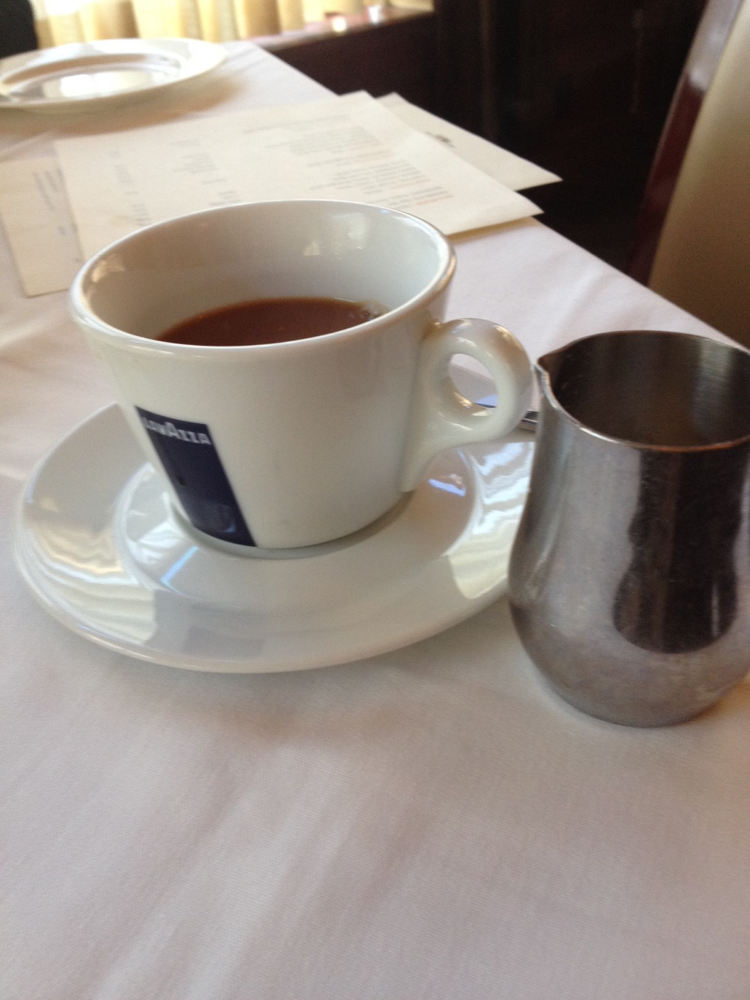

 We went out to [I Nonni](http://www.inonnirestaurant.com/) in Mendota Heights along the banks of the Mississippi River.
 We asked for a window seat, they had the curtains closed but you could still kind of see out the window.
 The coffee was very good, number 5 for sure.
 It was hot so I think that would be a 5 on temperature too.
 *And* she kept my cup full so that would be a 5 again (!), but the price was high.
 
 It was a bigger cup, maybe a 12 oz cup, but it was a nice shaped coffee cup. 
 The waitress would fill it around 3/4s full which was good because then you could put your cream in there with a little spoon to stir with.
 And I think it stayed hotter until you got down to the bottom of the cup because it wasn't so full
 And we had a 
 [Groupon](https://www.groupon.com/), 
 so we got a good deal on the food.
 But, of course, the decaf was the most important thing and *that* was excellent.

---

## **[Heirloom St. Paul](http://www.heirloomstpaul.com/)**

*2186 Marshall Ave, St Paul, MN 55104*

**Flavor 
 ☕️
 ☕️
 ☕️** 

**Temperature 
 ☕️
 ☕️
 ☕️** 

**Refill Frequency 
 ☕️
 ☕️ 
 ☕️ 
 ☕️** 

**Price 
 💲
 💲
 💲** 

    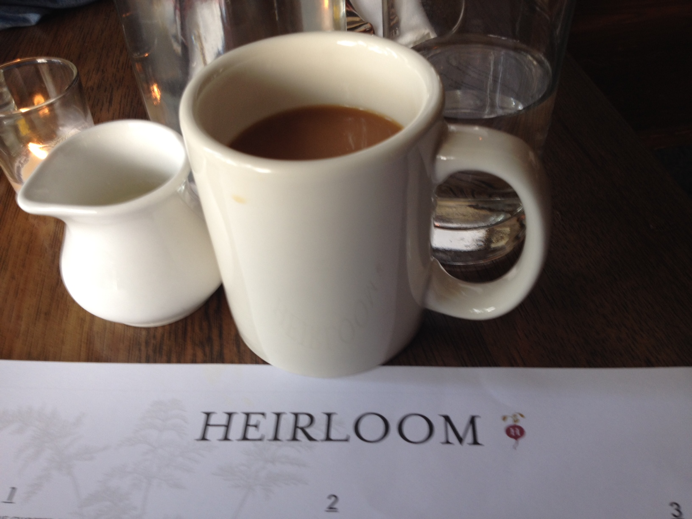

 
 We're in St. Paul at the [Heirloom restaurant](http://www.heirloomstpaul.com/).
 The coffee flavor was really good.
 I'd have to give it a 4.
 But as for the service, they didn't always keep my cup full.
 So I had to ask for a cup.
 Once a waiter did offer me a cup and he talked about decaf, but afterwards he brought me a cup of regular instead.
 He realized what he had done and I did get my decaf.
 So for refills I'd have to say it was about a 3 and for temperature I'd say about a 4.
 
---

## **[Caribou Coffee](https://www.amazon.com/gp/product/B01DZIIHTE/ref=as_li_tl?ie=UTF8&camp=1789&creative=9325&creativeASIN=B01DZIIHTE&linkCode=as2&tag=talker90-20&linkId=1327e7585386e7e5ce2c3811aee8abf2)**

*9008 Cahill Ave, Inver Grove Heights, MN 55076*

**Flavor 
 ☕️
 ☕️
 ☕️** 

**Temperature 
 ☕️
 ☕️
 ☕️** 

**Refill Frequency 
 ☕️ 
 ☕️ 
 ☕️ 
 ☕️ 
 ☕️** 

**Price 
 💲
 💲
 💲** 

    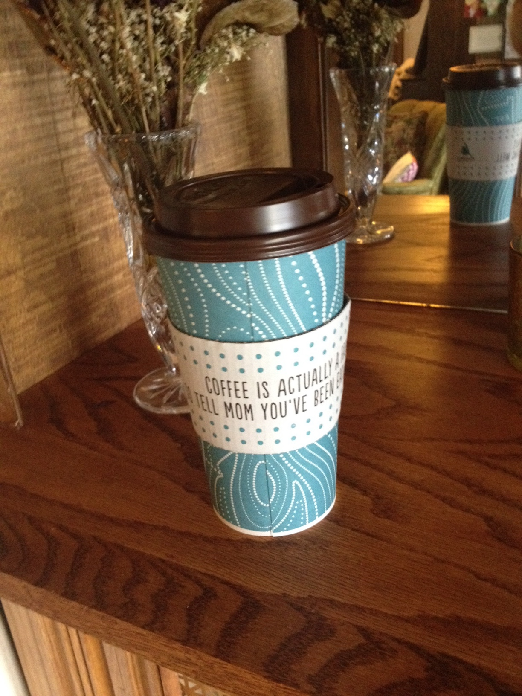

 We stopped at [Caribou Coffee](https://www.amazon.com/gp/product/B01DZIIHTE/ref=as_li_tl?ie=UTF8&camp=1789&creative=9325&creativeASIN=B01DZIIHTE&linkCode=as2&tag=talker90-20&linkId=1327e7585386e7e5ce2c3811aee8abf2)
 for decaf today and got a flavored coffee.
 It was a decaf milk chocolate mocha.
 They have a Tuesday special in August: 2 menu items for $5 dollars.
 So it was a really good deal.
 And it was hot and delicious.
 That's the nice thing about a coffee shop, when they roast the coffee and grind the coffee fresh it always has a great flavor.
 But then again, you don't get any refills.
 Although I could have drank both coffees instead of giving one away ;) hmmmm...
 
 So let's see, taste was really good, it was a delicious coffee, and it was hot 
 But there were no refils.
 $2.50 is kind of a high price if you don't get any refills.
 So it kind of depends on what you want
 This is Decaf Doug ™ signing off.
 
---

## **[The Uptowner](http://uptownercafeongrand.com/)**

*1100 Grand Ave, St Paul, MN 55105*

**Flavor 
 ☕️
 ☕️ 
 ☕️ ☕️** 

**Temperature 
 ☕️
 ☕️
 ☕️** 

**Refill Frequency 
 ☕️
 ☕️
 ☕️** 

**Price 
 💲💲💲** 

    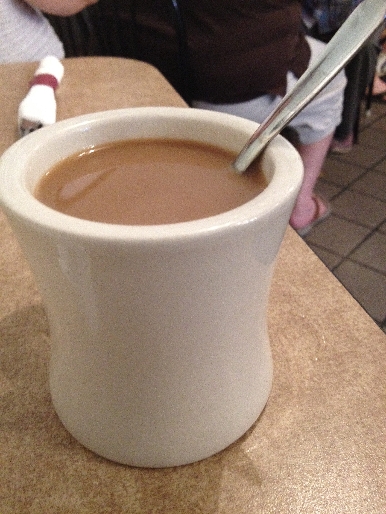

 
 Hello, this is Decaf Doug ™. The flavor was about average.
 I guess we could give the temperature a 5, it was really hot coffee.
 The refill frequency was good. 
 They didn't give me a pot, and they were really busy, but when my cup was empty they were still there within a minute.
 But the price was kind of high. It was $2.95 which I think makes them in a higher price range.
 The regular coffee did have a little more flavor than the decaf, but I don't know if that's a typical thing.
 So the Uptowner was very busy but still kept my coffee filled, it was hot, and it had a good flavor.
 They had a higher priced coffee but they had a coupon for my food, so it was like getting free coffee.
 Also, as a side note, they have free parking in the back before 3 o'clock which is always a good thing on Grand Avenue.
 This is Decaf Doug ™, signing out.

---

## **[Snuffy's](http://www.snuffysmaltshops.com/)**

*244 Cleveland Ave S, St Paul, MN 55105*

**Flavor 
 ☕️
 ☕️ 
 ☕️ ☕️** 

**Temperature 
 ☕️
 ☕️
 ☕️** 

**Refill Frequency 
 ☕️
 ☕️
 ☕️** 

**Price 
 💲
 💲
 💲** 

    

 
 Hello, this is Decaf Doug ™. I stopped at Snuffy's today and even though the coffee was average tasting but they were exceptional in refills.
 In fact, they even gave me a to-go cup and made *two* fresh pots of coffee!
 My cup was always filled so I never ran out of coffee. Even when I left I had coffee.
 The temperature was great, it was very hot, just how I like it.
 I think I covered everything. 
 I'd recommend it.
 And then if you go for food they usually have a coupon, but that may be another story.
 
---

## **[IHOP](https://www.amazon.com/gp/product/B00MV9OWLQ/ref=as_li_tl?ie=UTF8&camp=1789&creative=9325&creativeASIN=B00MV9OWLQ&linkCode=as2&tag=talker90-20&linkId=edb42216cdacb6685618151b290102d7)**

*2231 Killebrew Dr, Bloomington, MN 55425*

**Flavor 
 ☕️
 ☕️ 
 ☕️ ☕️** 

**Temperature 
 ☕️
 ☕️
 ☕️** 

**Refill Frequency 
 ☕️
 ☕️
 ☕️** 

**Price 
 💲
 💲
 💲** 

    

 
 The [IHOP](https://www.amazon.com/gp/product/B00MV9OWLQ/ref=as_li_tl?ie=UTF8&camp=1789&creative=9325&creativeASIN=B00MV9OWLQ&linkCode=as2&tag=talker90-20&linkId=edb42216cdacb6685618151b290102d7)
 coffee was hot and fresh and they even brought me a second pot when I asked for more coffee.
 They were quick about it so I never had an empty cup.
 The coffee had a good flavor but wasn't very strong coffee while still robust.
 It was hot and fresh and good tasting coffee.
 It was an average price at $2.29.
 The last time I was at an [IHOP](https://www.amazon.com/gp/product/B00MV9OWLQ/ref=as_li_tl?ie=UTF8&camp=1789&creative=9325&creativeASIN=B00MV9OWLQ&linkCode=as2&tag=talker90-20&linkId=edb42216cdacb6685618151b290102d7)
 they even gave me a to-go cup for my coffee, so they are super about getting you all the coffee that you could possibly drink.
 And that's important for Decaf Doug ™, to be able to have a sip of coffee all of the time.

---

## **[Red Cow](http://redcowmn.com/st-paul-selby-avenue/)**

*393 Selby Ave, St Paul, MN 55102*

**Flavor 
 ☕️
 ☕️
 ☕️** 

**Temperature 
 ☕️
 ☕️
 ☕️** 

**Refill Frequency 
 ☕️
 ☕️
 ☕️** 

**Price 
 💲
 💲
 💲** 

    

 
I liked the size of their mug. 
 It was a great size, probably a 16 ounce mug, and the coffee was fresh. 
 They made a fresh pot for me and the flavor was pretty good.

---

## **[The Lexington](http://thelexmn.com/)**

*1096 Grand Ave, St Paul, MN 55105*

**Flavor 
 ☕️
 ☕️
 ☕️** 

**Temperature 
☕️ 
 ☕️
 ☕️ 
 ☕️** 

**Refill Frequency 
 ☕️
 ☕️
 ☕️** 

**Price 
 💲
 💲
 💲**

    

 
The Lexington had the best coffee service ever.
 My cup was aways full.
 They had a little coffee server with about 2 cups of coffee in it and the coffee was always fresh too.
 And it was good tasting coffee, with fresh cream in a little pitcher.
 Very nice.

---

## **[The Broiler](http://www.stclairbroiler.com/)**

*1580 St. Clair Avenue St. Paul, MN*

**Flavor ☕️
 ☕️ 
 ☕️ 
 ☕️** 

**Temperature 
 ☕️
 ☕️ 
 ☕️ 
 ☕️** 

**Refill Frequency 
 ☕️
 ☕️ 
 ☕️ 
 ☕️** 

**Price 
 💲
 💲
 💲** 

    

 
Hey coffee lovers. 
 I went to the Broiler today and I had an empty cup for a long time. 
 Usually they are pretty good. 
 Sometimes they bring a pot, but the waiter wanted to serve one cup at a time. 
 And they had a lot of servers so I don't know what the deal was. 
 But their coffee is pretty good, it was hot, and freshly brewed.

---
---

# Lifestyle

---

**Decaf Doug's Wisconsin Wedding**

*A little too hot for a tuxedo, but never too hot for coffee*

**Flavor ☕️
 ☕️ 
 ☕️ 
 ☕️** 

**Temperature 
 ☕️
 ☕️
 ☕️** 

**Refill Frequency 
 ☕️
 ☕️
 ☕️** 

    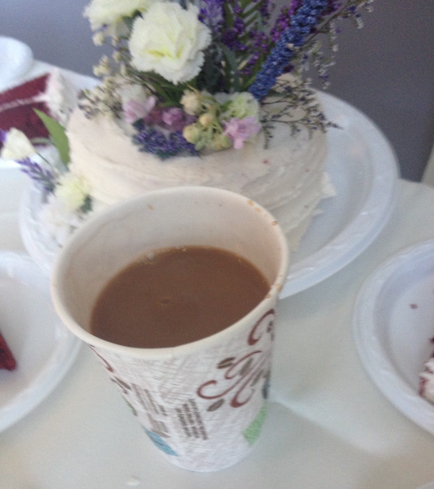

 
 
 We went to a wedding in [Salem, Wisconsin](https://goo.gl/maps/b1yzJDHnbTF2) at [Stein Farms](https://www.theknot.com/marketplace/stein-farms-salem-wi-998035). 
 It's a big wedding center, it's a beautiful setting. 
 It was catered by the [Stowell's Catering Service](http://www.stowellscatering.com/) out of [Burlington, Wisconsin](https://goo.gl/maps/HTCNs73sd2D2), not to be confused with the [Burlington Coat Factory](https://www.burlington.com/) as the groom did when he first met the bride. 

 After the wedding the first thing I looked for in the dining room was the coffee. 
 It was at the cake table with their wedding cake and cookies. 
 The wedding cake didn't have the usual decorations and I heard that they call that a "naked cake." 
 It was okay coffee, a number 3, it had a decent flavor. 
 In fact it was better than the [IHOP](http://decafdoug.com/#review_ihop) coffee we had earlier in the day on the drive down. 
 It was really hot, a number 5. 
 And the temperature outside was really hot too, it was over 90 degrees and the wedding was outside. 
 We had all kinds of record highs for Memorial Weekend this year. 
 
 The coffee was in a percolator pot but it didn't get bitter over the course of the day, my last cup of coffee was almost as good as my first. 
 It was enough coffee, I just had to go over and keep filling my cup. 
 And I was close to the coffee so that was pretty handy.
 
 All in all it was a great wedding. 
 Best wishes and congratulations to the lovely bride and the groovy groom.
 
---

## **[Grand Olde St. Mark's Festival](http://www.markerspride.com/index.php/home-festival)**

*[Third weekend of May each year](https://goo.gl/maps/m7Hq8sX3LG32)*

**Flavor ☕️
 ☕️ 
 ☕️ 
 ☕️** 

**Temperature 
 ☕️
 ☕️
 ☕️** 

**Price 
 💲
 💲 
 💲** 

 

    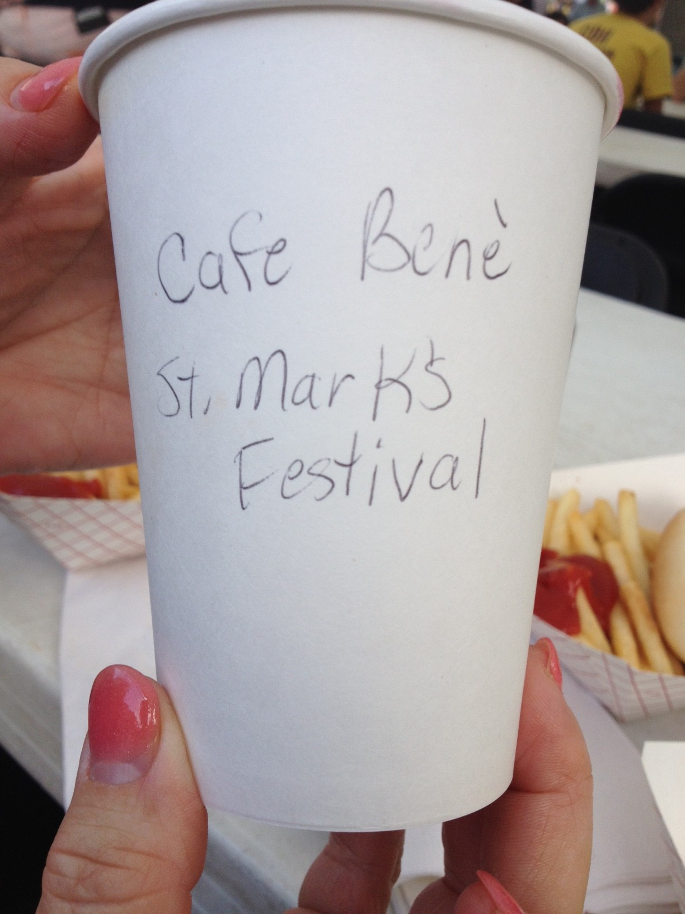

 
 
 We went to the [St. Mark's festival](http://www.markerspride.com/index.php/home-festival) last week. 
 It was a really neat deal. 
 They have rides for the kids, food, and music. 
 They also had decaf coffee!
 
 So I thought the first thing I would do is get a cup of decaf coffee and it was a dollar. 
 But they didn't have refills. 
 However, the interesting thing is that they were sponsored by [Coffee Bené](https://www.coffeebene.com/) which is down on [Cleveland](https://goo.gl/maps/eC9YNVR2sWM2) and is part of [Davanni's](https://www.davannis.com/) pizza and hoagies. 
 
 It was okay coffee, I'd give it a 3. 
 The price was low, but you only got one cup, there were no free refills. 
 But the temperature was a 5, it was really hot coffee, I was kind of surprised. 
 They've got a really good air-pot there that kept the temperature really hot. 
 Overall, it was fun to sit outside, listen to the music, and have dinner. 
 They have a lot of different foods there. 
 It was a fun time at the [St. Mark's festival](http://www.markerspride.com/index.php/home-festival).
 
---

**Decaf Doug "Sip of the Day" ™**

*Cover your coffee*

 

    

 
Now that the snow's off the roads, we are finding all these potholes and running into them!

It's bad enough you could damage your car, but for sure you don't want to spill your cup of coffee.

---

## **[We Are Nuts](http://www.wearenutsmn.com/)**

*For coffee nuts like me!*

 

    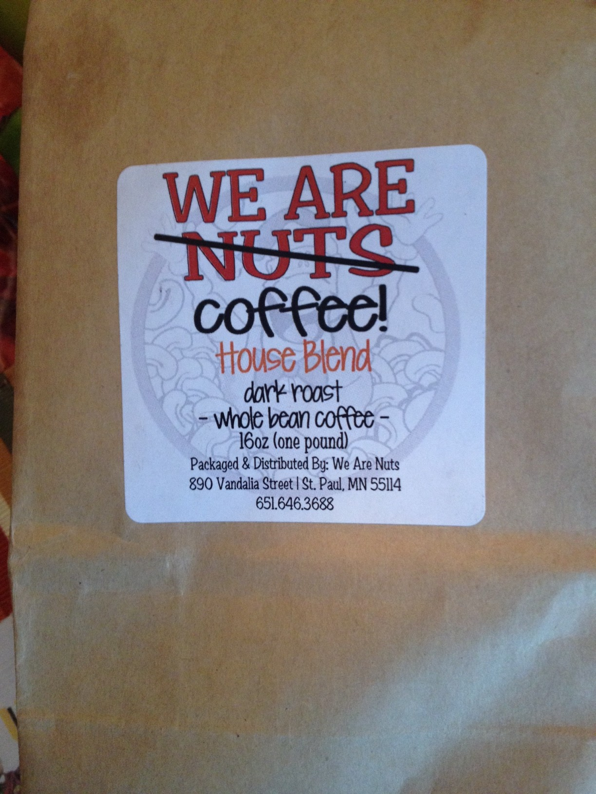

 
 With the cold weather and the holidays coming, another tradition is [We Are Nuts](http://www.wearenutsmn.com/). 
 They are only open October to January and they freshly roast nuts each day. 
 It is a really good place for your holiday baking. 
 And this year they are roasting coffee! 
 We tried the coffee from [We Are Nuts](http://www.wearenutsmn.com/), but I must say, it lacks flavor. 
 It lacks body. 
 It wasn't that great. 
 We got the regular coffee to try it and decided it would be better to make it half-and-half with decaf. Because it really doesn't have the flavor. 
 So I think they'll have to keep practicing with their coffee roasting. 
 
---

## **[Caribou Coffee Medium Roast Decaf](https://www.amazon.com/gp/product/B01DZIIHTE/ref=as_li_tl?ie=UTF8&camp=1789&creative=9325&creativeASIN=B01DZIIHTE&linkCode=as2&tag=talker90-20&linkId=3d2ba29f79f1f8d0d483166594d7bb80)**

*A great decaf to enjoy at home*

 

    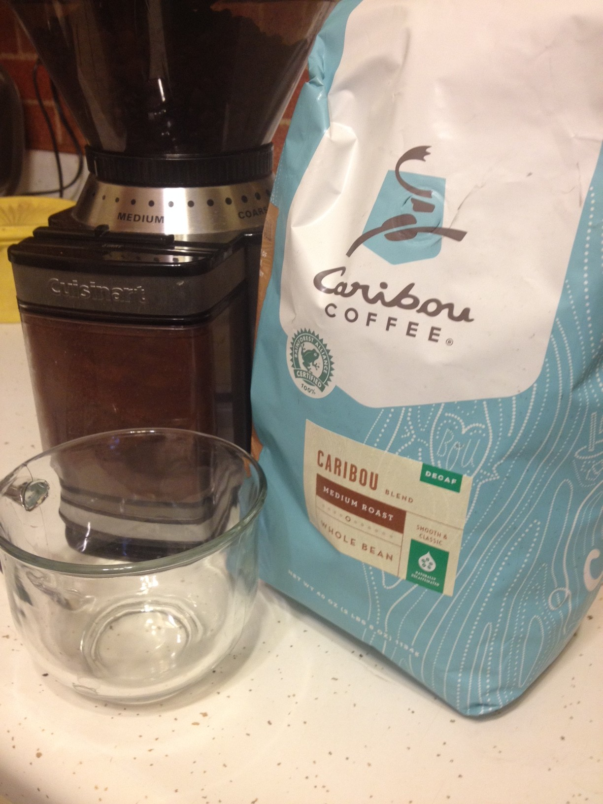

 
 We got some good decaf at the house now, it's [whole bean, medium roast coffee from Caribou](https://www.amazon.com/gp/product/B01DZIIHTE/ref=as_li_tl?ie=UTF8&camp=1789&creative=9325&creativeASIN=B01DZIIHTE&linkCode=as2&tag=talker90-20&linkId=64408efa1387938b9715aa5e79773cfc).
 So at [Sam's Club](https://www.samsclub.com/sams/) you get a 40oz bag, so that's 2 1/2 lbs, for $17.98.
 And it makes a great cup of coffee.
 It has a lot of flavor, so i'm using it for half-caff too with a regular coffee that isn't so flavorful.
 
---

**Decaf Doug™ at the [country club](http://www.tcc-club.com/)**

*[Town & Country Club](http://www.tcc-club.com/)*

**Flavor 
☕️
 ☕️
 ☕️** 

**Temperature 
 ☕️
 ☕️
 ☕️** 

**Refill Frequency 
 ☕️
 ☕️
 ☕️** 

 

    

 

 We had the good fortune of being invited to a dinner party for a retirement at the [Town and Country](http://www.tcc-club.com/) country club ([*300 N Mississippi River Blvd, St Paul, MN 55104*](https://goo.gl/maps/f6ch11NmrCn)).
 This country club is the oldest in Minnesota and the first country club in Minnesota. 
 It was inspired by the clubs in St. Paul formed because of the annual Winter Carnival, which is coming up soon -- so [buy your Winter Carnival buttons now](mailto:nadi0016@umn.edu?subject=Winter%20Carnival%20Button%20interest)!

 We had outstanding service and fine food along with pretty good decaf.
 It was hot, they had a really good thermos that kept it hot the whole time.
 I had as much as I wanted, so we'll have to give it a number 5 for refills.
 It earned a number 4 for flavor, it was pretty good.
 And the coffee came with dinner so we don't have to put a price on it.
 Also, the room was decorated for the holidays, which reminds me to send my seasons greetings to everyone!
 
---

## **[Caribou Coffee](https://www.cariboucoffee.com/) holiday treats**

[*various locations*](https://locations.cariboucoffee.com/)

 

    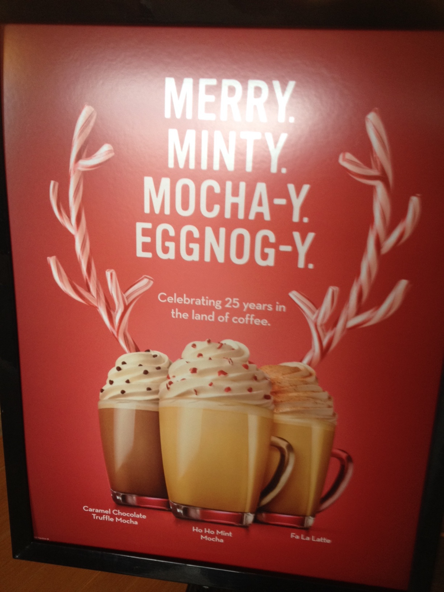

 There's a chill in the air, it's getting cold outside, and the holidays are coming.
 So we thought we'd stop at [Caribou](https://www.cariboucoffee.com/) for a ['Ho Ho Mint Mocha'](https://www.cariboucoffee.com/menu-nutrition/beverage-food-detail?id=522489&type=drink).
 It was very good, but it was really sweet.
 They have peppermint candies in it and white chocolate.
 Of course, [Caribou Coffee](https://www.cariboucoffee.com/) is really good.
 They brew the coffee right there.
 We got a ['Ho Ho Mint Mocha'](https://www.cariboucoffee.com/menu-nutrition/beverage-food-detail?id=522489&type=drink) so it was really hot and delicious.
 Like a dessert.
 It's a dessert coffee.
 The medium size is $3.69 and there's no refills so it wouldn't be my everyday choice but it would be good for holiday dessert.
 
---

## **[St. Clair Broiler](http://www.stclairbroiler.com/)**

*A heartfelt farewell to one of our absolute favorites*

*** Bye, bye Broiler *** These are the last days of the St. Clair Broiler. 
 61 years I guess they were around. 
 We used to go there quite a bit over the 40 years we've been in the neighborhood.
 They had pretty good coffee.
 It was a great place to meet, they had good food, a good atmosphere, and of course the Friday night fish fry.
 But then there was the "square plate controversy"... :)
 Most of everything was good about the Broiler. 
 We're going to miss the place.
 
 Okay, bye bye Broiler :'(
 
---

**Decaf Doug ™: JUST BREW IT.**

*[Seattle's Best Ground Coffee](https://www.amazon.com/gp/product/B00CIYR4IC/ref=as_li_tl?ie=UTF8&camp=1789&creative=9325&creativeASIN=B00CIYR4IC&linkCode=as2&tag=talker90-20&linkId=f6d6417725e2e06f1b1d846679abb838) (Seattle should have the best! That's where they essentially started the coffee roasting revolution)*

 

    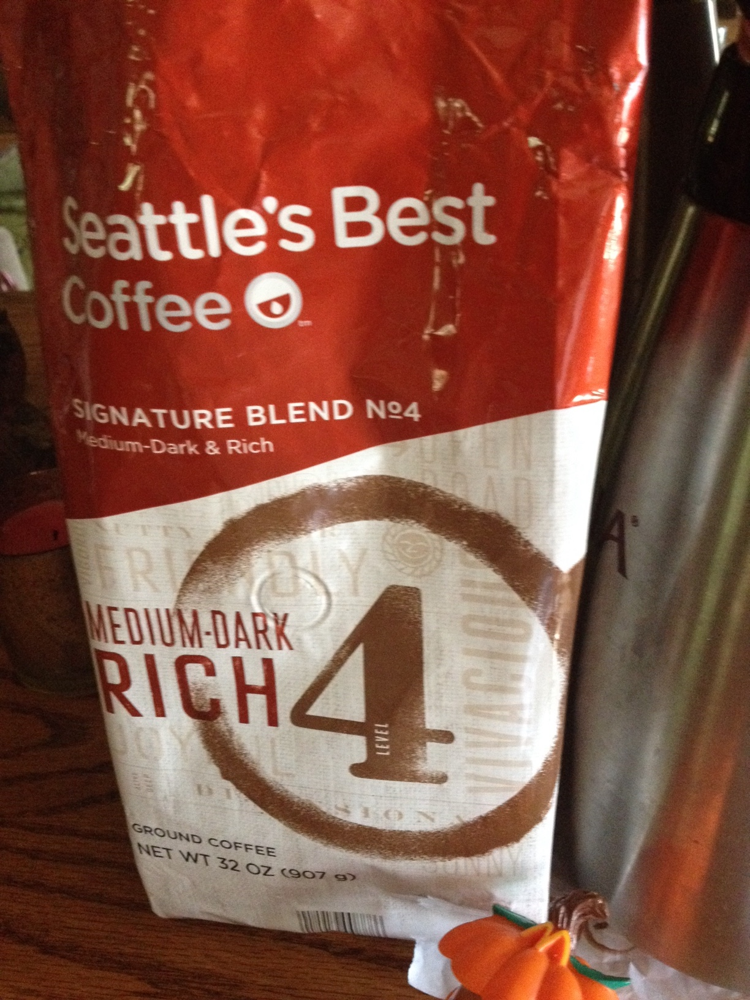

 
 Our best morning coffee so far has been [Seattle's Best](https://www.amazon.com/gp/product/B00CIYR4IC/ref=as_li_tl?ie=UTF8&camp=1789&creative=9325&creativeASIN=B00CIYR4IC&linkCode=as2&tag=talker90-20&linkId=9a5d389b09dc08bc12fcce9a0086c106).
 It comes as a ground coffee.
 We've been getting it over at [Sam's Club](https://www.samsclub.com/sams/homepage.jsp) so they usually have the ["number 4"](https://www.amazon.com/gp/product/B00CIYR4IC/ref=as_li_tl?ie=UTF8&camp=1789&creative=9325&creativeASIN=B00CIYR4IC&linkCode=as2&tag=talker90-20&linkId=9a5d389b09dc08bc12fcce9a0086c106)
 and it's a medium dark.
 We also got this ["6th Avenue Bistro"](https://www.amazon.com/gp/product/B01N9TN82B/ref=as_li_tl?ie=UTF8&camp=1789&creative=9325&creativeASIN=B01N9TN82B&linkCode=as2&tag=talker90-20&linkId=7b075732b5c00c3fe66b4a71e36cefb4), 
 well that also says "number 4"...
 Well, it says it's "dark roast, smooth roasted ground coffee."
 
 I saw the number 4 on Amazon and they have a special deal where you can get [two 2lb bags](https://www.amazon.com/gp/product/B00VKLDQTU/ref=as_li_tl?ie=UTF8&camp=1789&creative=9325&creativeASIN=B00VKLDQTU&linkCode=as2&tag=talker90-20&linkId=c96ff38e5f9ee0993c70c3c3be914b48)
 and it's like $37.96.
 And if you have Amazon Prime you get free next day delivery.
 So it's a better price than buying 1 bag at a time, it saves you like $5 bucks on the two bags.
 
 So it'a ground coffee with a great flavor.
 You can even use a little less coffee and still get a great flavor.
 So it may get you a little farther if you measure it out every time.
 
---

**Decaf Doug ™: JUST BREW IT.**

*Dunk your mornings in [Dunkin' Donuts Ground Coffee](https://www.amazon.com/gp/product/B009HSNDI2/ref=as_li_tl?ie=UTF8&camp=1789&creative=9325&creativeASIN=B009HSNDI2&linkCode=as2&tag=talker90-20&linkId=53b950077a778d8b26274e2fc540f107)*

 

    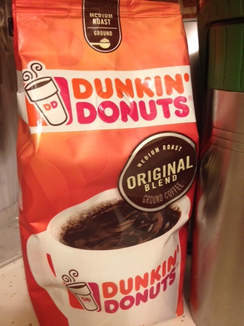

 
 So yeah, the [Dunkin' Donuts](https://www.amazon.com/gp/product/B009HSNDI2/ref=as_li_tl?ie=UTF8&camp=1789&creative=9325&creativeASIN=B009HSNDI2&linkCode=as2&tag=talker90-20&linkId=adfcb82777d405ce38e50459f8297e20)
 coffee was pretty good.
 And I was actually surprised because we got the *ground* coffee but it had as much flavor as when we get beans and grind them. 
 So i was really impressed with the [Dunkin' Donuts](https://www.amazon.com/gp/product/B009HSNDI2/ref=as_li_tl?ie=UTF8&camp=1789&creative=9325&creativeASIN=B009HSNDI2&linkCode=as2&tag=talker90-20&linkId=adfcb82777d405ce38e50459f8297e20)
 coffee.
 And that's on [Amazon](https://www.amazon.com/gp/product/B009HSNDI2/ref=as_li_tl?ie=UTF8&camp=1789&creative=9325&creativeASIN=B009HSNDI2&linkCode=as2&tag=talker90-20&linkId=6225fc532c6e095def0a025aa87c00c5)
 which is convenient.
 
 And then I noticed their bakery series flavored coffees, they have a [cinnamon coffee](https://www.amazon.com/gp/product/B00W4DDRXI/ref=as_li_tl?ie=UTF8&camp=1789&creative=9325&creativeASIN=B00W4DDRXI&linkCode=as2&tag=talker90-20&linkId=53439c89228b9632d4360c8228770975)
 that's $6.63 for the 11oz package.
 So they have quite a few different flavors there in their bakery series.

 We had their [original](https://www.amazon.com/gp/product/B009HSNDI2/ref=as_li_tl?ie=UTF8&camp=1789&creative=9325&creativeASIN=B009HSNDI2&linkCode=as2&tag=talker90-20&linkId=adfcb82777d405ce38e50459f8297e20)
 coffee and that was $7.19 for 12 ounces, so that's like $9.50 per pound. 
 So that's not a bad price.
 So i'd recommend the [Dunkin' Donuts](https://www.amazon.com/gp/product/B009HSNDI2/ref=as_li_tl?ie=UTF8&camp=1789&creative=9325&creativeASIN=B009HSNDI2&linkCode=as2&tag=talker90-20&linkId=adfcb82777d405ce38e50459f8297e20)
 coffee for your morning coffee, especially if you don't have a grinder so you can't grind beans.
 It has a great flavor for a ground coffee.
 
---

**Decaf Doug™ and the [Defeat of Jesse James Days](http://www.djjd.org/)**

*The Decaf of Jesse James*

**Flavor ☕️
 ☕️ 
 ☕️ 
 ☕️** 

**Temperature 
 ☕️
 ☕️
 ☕️** 

**Refill Frequency 
 ☕️
 ☕️
 ☕️** 

**Price 
 💲
 💲 
 💲** 

    

 
 
 We were in Northfield for the deca--I mean De*feat* of Jesse James! 
 The parade was Sunday morning so we went to the VFW(*516 Division St S, Northfield, MN 55057*) for their all you can eat pancake breakfast. 
 They had coffee included, so i had regular and decaf. 
 The decaf was so-so, so I I give it a number 2, but it was hot and fresh. 
 We did have to fill our own cup once, but otherwise refills were pretty good. 
 So I guess we could give them a 3 or 4 or the refills. 
 The price was low because the coffee came with breakfast, which wasn't that much. Especially with an all you can eat deal! Okay, bye!
 
---

**Decaf Doug™ visits Wisconsin**

*[Not Justa Bar & Cafe](http://www.notjustacafeandbar.com/Somerset.html) review*

**Flavor ☕️
 ☕️ 
 ☕️ 
 ☕️** 

**Temperature 
 ☕️
 ☕️ 
 ☕️ ☕️** 

**Refill Frequency 
 ☕️
 ☕️
 ☕️** 

**Price 
 💲
 💲
 💲** 

    

 
 
In Wisconsin we went to the [Not Justa Cafe](http://www.notjustacafeandbar.com/Somerset.html)(*850 N Knowles Ave, New Richmond, WI 54017*), but the decaf was so-so. 
 Luckily my sister got regular coffee, so I was able to drink her coffee by mixing up my half decaf. 
 It wasn't that hot either, I'd have to give it a three. 
 And then again the regular coffee was hotter, so I mixed that in with my decaf. 
 *But* the refills were good because each one of us got our own pot of coffee. 
 The price was like a number 2.

So the decaf wasn't the best, but it wasn't too bad when I mixed it with regular coffee and it was a nice day to visit with family over in Wisconsin.

---

**Happy Coffee Day from Decaf Doug ™!**

*...except every day is Coffee Day for me...*

    

 
 Happy National Coffee Day!
 The 29th of September is National Coffee day. 
 I got an email from [Super America](http://superamerica.com/) for a free coffee, any size.
 So I'm going to be going over there.
 I noticed that [Kwik Trip](https://www.kwiktrip.com) offers a free 16 ounce coffee if you're on their [text program](https://www.kwiktrip.com/Savings/Kwik-Club).
 So be sure to [check around in your area](https://business.gasbuddy.com/blog-national-coffee-day-deals/) where you can get a free coffee for Friday the 29th of September, National Coffee Day.
 This is a go-ahead for free coffee from Decaf Doug ™.
 
---

**Decaf Doug ™ Goes to the Fair**

*[Nativity County Fair](https://school.nativity-mn.org/nativity-county-fair) review*

**Flavor 
☕️
 ☕️
 ☕️** 

**Temperature 
 ☕️
 ☕️
 ☕️** 

**Refill Frequency 
 ☕️
 ☕️ 
 ☕️ 
 ☕️** 

**Price 
 💲
 💲 
 💲** 

    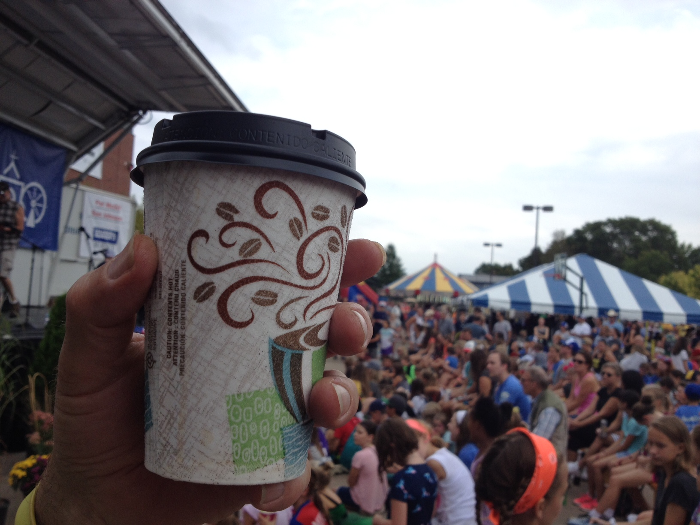

 
 
 We went to the [Nativity County Fair](https://school.nativity-mn.org/nativity-county-fair) where they have coffee and desserts.
 The people of the parish bring in baked goods, like a bake sale.
 So that was really neat.
 But the coffee this year was the best I've ever had at the fair.
 And I've went to the fair quite a few times as the fair's been around for 25 years.

 It was a 
 [Starbucks decaf](https://www.amazon.com/gp/product/B003JMC6Q2/ref=as_li_tl?ie=UTF8&camp=1789&creative=9325&creativeASIN=B003JMC6Q2&linkCode=as2&tag=talker90-20&linkId=7bb5c6d1a225b56eb3c44a46b83da915)
 and it was even better than the regular coffee (!), so I would give it a 4 for flavor.
 And even though it was in one of those coffee servers, the temperature was hot.
 So I would give it a 4 for that as well.
 We did get a refill, but i only got one, so we'll have to go for a 2 for refills.
 And the price was low, only $1.
 
 There was beautiful weather and it was great to get out and support the [Nativity School](https://school.nativity-mn.org/)

---

**Decaf Doug ™ Goes to a Wedding**

*Grounds for Celebration*

**Flavor 
☕️
 ☕️ 
 ☕️ 
 ☕️** 

**Temperature 
 ☕️
 ☕️
 ☕️** 

**Refill Frequency 
 ☕️
 ☕️
 ☕️** 

    

 
 
 We went to a wedding this weekend outside of Northfield in an airplane hangar!
 I wasn't really sure about reviewing their decaf, but the hostess asked me to.
 However, I'll unfortunately have to say, sorry ["Mrs. Olsen"](https://youtu.be/ffUEM4hNibk) :/ , that the decaf coffee flavor was only a 2.
 The proportions of
 [Folgers Decaf](https://www.amazon.com/gp/product/B010ULFNW8/ref=as_li_tl?ie=UTF8&camp=1789&creative=9325&creativeASIN=B010ULFNW8&linkCode=as2&tag=talker90-20&linkId=c7e0b3ce264e5bb9d551b6fd567c2f50)
 sounded good, so it must have been that the coffee maker wasn't brewing correctly.
 *But* it was served hot, we had plenty of coffee all night from a lovely coffee server, and real cream.
 So I got a really good cup of coffee when I mixed my half decaf with half regular and cream.
 It's always great to celebrate with friends and family for the terrific occasion of a wedding, even if the decaf coffee flavor only gets a 2.
 The coffee price was non-applicable because it was included with the invitation.
 
 Congratulations Aimee and Matt! May you have a long, wonderful life together with plenty of decaf ☕️
 
---

**Decaf Doug ™ Up North**

*[Vannelli's by the Lake](http://www.vannellisbythelake.com/menu/0/menus.aspx) review*

**Flavor ☕️
 ☕️ 
 ☕️ 
 ☕️** 

**Temperature 
 ☕️
 ☕️ 
 ☕️ ☕️** 

**Refill Frequency 
 ☕️
 ☕️
 ☕️** 

**Price 
 💲
 💲
 💲** 

 

    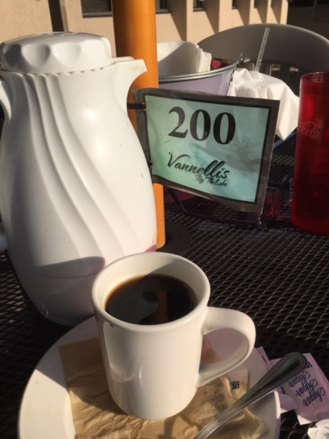

 
 
 We have one more lake, Forest Lake, where we stopped at [Vannelli's by the Lake](http://www.vannellisbythelake.com/menu/0/menus.aspx) (*55 Lake St S, Forest Lake, MN 55025*).
 We were out on the patio.
 We were on the street side though, it seemed like the patio might wrap around to the lake.
 But it was pretty nice to sit outside in a beautiful Minnesota summer evening.
 The decaf was good... I'd give it about a 3 for flavor.
 It was in a coffee server, a thermos, so it was about a 3 for temperature too.
 But the amount was good, because they made me an extra pot.
 So I had plenty of coffee
 
---

**Decaf Doug ™ Up North**

*[Grand Buffet Mille Lacs](https://grandcasinomn.com/dining/) review*

**Flavor ☕️
 ☕️ 
 ☕️ 
 ☕️** 

**Temperature 
 ☕️
 ☕️
 ☕️** 

**Refill Frequency 
 ☕️
 ☕️
 ☕️** 

**Price 
 💲
 💲 
 💲** 

 

    

 
 
 And of course since we were up there at Mille Lacs Lake, we had to go to the [Grand Casino](https://grandcasinomn.com/dining/grand-buffet-mille-lacs/) (*777 Grand Avenue Onamia, MN 56359*).
 They have their buffet and Monday through Wednesday is their prime rib night. 
 So that was really good. 
 But anyway, back to the decaf, ha!
 The decaf, you know, was just kind of average...
 But our server Jennifer kept my cup full.
 If I went up to get more food with an empty cup, when I came up I had a full cup waiting for me.
 I'd have to say it'd be a lower price because the coffee and desert were included in our dinner.
 So it was hot and fresh, but I guess I'd have to give it a 2 for flavor.
 And the frequency of refills was excellent. 
 Plus, we were right across the road from Mille Lacs Lake.

---

**Decaf Doug ™ Up North**

*[Izatys Resort](http://izatys.com/) review*

**Flavor ☕️
 ☕️ 
 ☕️ 
 ☕️** 

**Temperature 
 ☕️
 ☕️
 ☕️** 

**Refill Frequency 
 ☕️
 ☕️ 
 ☕️ ☕️** 

**Price 
 💲
 💲 
 💲** 

 

    

 

 This is Decaf Doug up at the lake, Mille Lacs Lake, at [Izaty's](http://izatys.com/) (*40005 85th Ave, Onamia, MN* ) for fish and chips, eh? 
 So the decaf coffee was really cheap, it was $1.87, which I thought was really good, that's one of the lower prices I've seen.
 They made me a fresh pot, but they had a big group so she didn't get to my cup too often. I still got 3 cups of coffee and she still filled it pretty regularly, but it wasn't as fast as I'm used to. 
 The flavor was about average.
 The temperature was hot and the price was really good.
 The price was on the low end so it was a bargain.
 And we got a view of the pool from the restaurant.
 
---

**Decaf Doug ™ Up North**

*[The Wharf Resort & Toucan's Restaurant and Bar](https://wharfmn.com/) review*

**Flavor 
☕️
 ☕️
 ☕️** 

**Temperature 
 ☕️
 ☕️
 ☕️** 

**Refill Frequency 
 ☕️
 ☕️
 ☕️** 

**Price 
 💲
 💲 
 💲** 

 

    

 

 The best decaf we had at the lake was at a place called the [Wharf Resort](https://wharfmn.com/) (*5101 Whistle Rd, Isle, MN 56342*), it was very hot and delicious.
 She made a fresh pot for me too.
 So our server Sue said that a lot of people, even regular coffee drinkers, get the decaf because when they smell her brewing a fresh pot of decaf they order the decaf. They like it better than the regular coffee!
 And this was dinner time for me so of course I wanted the fresh decaf.
 The price was only $1.85 so it was lower price, and it was very good.
 It was the best decaf on the lake.
 Another interesting thing, I looked them up on Facebook and Governor Dayton was there in July because they have a big resort there with lots of boats, ice houses, and things like that. 
 
 So the coffee was hot, it was fresh, and she kept my cup filled too. 
 They had a nice mug too, I liked those mugs.
 And they even had their name on them.
 
---

**Decaf Doug ™ Up North: JUST BREW IT.**

*[Coco Moon Coffee Bar & Gift](https://m.facebook.com/Coco-Moon-305158647898/)*

    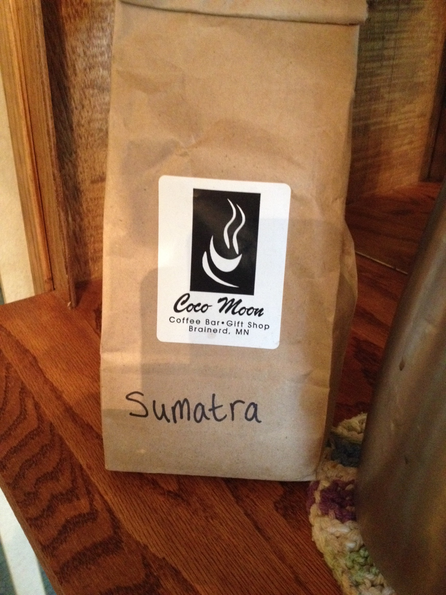

 
 
 So after we had our lunch and decaf in Brainerd, we walked next door to the [Coco Moon Coffee Bar & Gift](https://m.facebook.com/Coco-Moon-305158647898/) (*601 Laurel St, Brainerd, MN 56401*)
 and we picked up a pound of some Sumatra dark roast coffee.
 Oh boy, that was really good.
 We got it ground because we were taking it to the cabin, so we had some really good coffee that we could make in the morning.
 The price, you know, was a coffee shop price, over $10 per pound.
 But it was really good coffee.
 
---

**Decaf Doug ™ Up North**

*[Northwind Grille](http://www.northwindgrille.com/) review*

**Flavor ☕️
 ☕️ 
 ☕️ 
 ☕️** 

**Temperature 
 ☕️
 ☕️
 ☕️** 

**Refill Frequency 
 ☕️
 ☕️
 ☕️** 

**Price 
 💲
 💲
 💲** 

 

    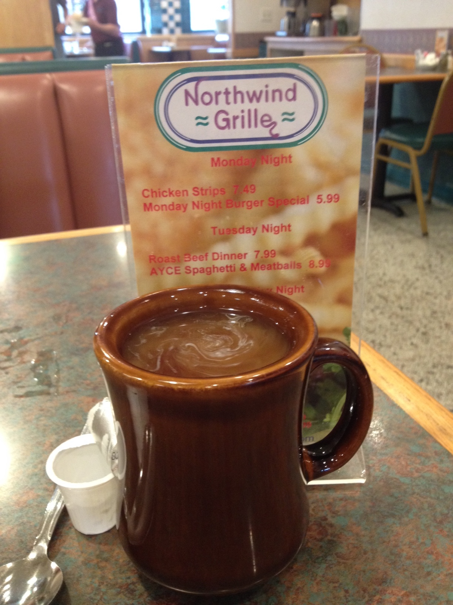

 
 
 We did have some decaf in Brainerd another day. 
 We stopped for lunch at the [Northwind Grille](http://www.northwindgrille.com/) (*603 Laurel St, Brainerd, MN 56401*).
 It was about an average flavor, I'd give it a 3.
 It was nice and hot, so I'd give it a 4 for the temperature.
 And it was $1.80 in price, so that would be like a number 2 for price.
 But refills were great!
 
 They kept filling up my cup.
 I was right by the coffee maker so that was good.
 I couldn't see what kind of coffee they were making, but they used pre-measured packets.
 That's always good if you have a waitstaff of people who don't drink coffee, then they at least use the right amount of coffee to make it.
 Another interesting thing about the Northwind Grille is that they had a coffee shop right next door.
 I didn't have coffee there, but we did buy some beans there though.
 So maybe I'll review the beans in the next post ;)
 
---

**Decaf Doug ™ Up North**

*How to caffeinate your mornings, even on vacation*

 This is Decaf Doug ™ out at the lake, up here at Lake Mille Lacs.
 In the morning I gotta have regular coffee, so we went to a few places for breakfast and had coffee.
 The first place we went was in Isle, the [Country Corner Cafe](https://www.facebook.com/pages/Country-Corner-Cafe-Isle-MN/164060930324927) (*485 W Main St, Isle, MN 56342*).

 It was only a dollar for coffee and it was the
 [Folgers Decaf](https://www.amazon.com/gp/product/B010ULFNW8/ref=as_li_tl?ie=UTF8&camp=1789&creative=9325&creativeASIN=B010ULFNW8&linkCode=as2&tag=talker90-20&linkId=c7e0b3ce264e5bb9d551b6fd567c2f50) 
 I believe. 
 So it wasn't too bad.

 But the next day we went to [Eddy's Launch Bar and Grill](http://eddysresort.com/eat/) (*41334 Shakopee Lake Road, Onamia, MN 56359*) which was right on the lake, so that was kind of nice.
 We got to eat outside.
 The coffee was a little better.
 They had flavored creamers too so I tried the hazelenut creamer in my coffee.
 
 But the best place we found was in Onamia so we went there twice.
 They had real cream that they served in a pitcher.
 It was a farm-to-table kind of restaurant called [Farm Market Café](http://farmmarketcafe.com/) (*Trailside Center 108 W, Onamia, MN 56359*).
 So the food was really good.
 Eddy's was $2.00 for coffee, they were all bottomless cups, and the farm-to-table restaurant was $1.75.
 
 We stopped at [Bobbies Kitchen](https://www.google.com/maps/uv?hl=en&pb=!1s0x52b6bc1277b66177%3A0x190f9b8e355bfbaf!2m17!16m16!1b1!2m2!1m1!1e1!2m2!1m1!1e3!2m2!1m1!1e6!2m2!1m1!1e4!2m2!1m1!1e5!3m1!7e115!4shttps%3A%2F%2Fpicasaweb.google.com%2Flh%2Fsredir%3Funame%3D108583936335115061639%26id%3D6342122126140301746%26target%3DPHOTO&imagekey=!1e3!2s-cm-prxni0v8%2FWAO-eMK84bI%2FAAAAAAAA6bc%2FMEDwqoXAH48UWyE2IWO74-U7iF7ADyQlwCLIB&sa=X&ved=0ahUKEwiL0v2I5t7VAhUH_4MKHWnJBSEQoioIcDAK&activetab=main) (*1202 S 6th St, Brainerd, MN 56401*) in Brainerd.
 They didn't have decaf at all, which was disappointing, but they had a pretty good regular coffee.
 And it was served by Bobbie's sister.
 It was pretty hot but it just had an average flavor.
 It was $1.75 for a bottomless cup and it wasn't decaf, it was regular coffee.
 So the price was lower, it was hot, and it was an average flavor.
 But the biggest thing is that Bobbie's sister served us.
 I think that's all I have to say about those places with regular coffee in the morning!
 
 So then on our drive back from the lake, which was Gull Lake, we stopped at this place called [Adirondack Coffee](https://lovemymug.com/) (*25469 Main St, Nisswa, MN 56468*).
 It was a great place.
 The main reason we stopped there was to use the bathroom so we could drink more coffee.
 We had an americano, it was very hot.
 It was a higher price because it was the espresso that they made.
 We got regular coffee for the drive but I noticed some interesting decaf packs.
 
---

**Decaf Doug "Sip of the Day" ™**

*The mysterious "half-caff"*

 

    

 
 Okay, Decaf Doug ™ tip of the day: 
 I'm driving this afternoon so I'm making a *half* decaf.
 You don't want all decaf when you're driving!
 
 So that's my tip of the day.
 
---

**Decaf Doug ™: JUST BREW IT.**

*[Tim Horton's](https://www.amazon.com/gp/product/B003YVTJKO/ref=as_li_tl?ie=UTF8&camp=1789&creative=9325&creativeASIN=B003YVTJKO&linkCode=as2&tag=talker90-20&linkId=8d5af9d056e37dda53eac7cba00abd01)
 Canadian coffee, Eh*

    

 
 So [Tim Horton's](https://www.amazon.com/gp/product/B003YVTJKO/ref=as_li_tl?ie=UTF8&camp=1789&creative=9325&creativeASIN=B003YVTJKO&linkCode=as2&tag=talker90-20&linkId=8d5af9d056e37dda53eac7cba00abd01)
 coffee is new to the Twin Cities.
 I think they're from Canada, Eh?
 So it was a good value for ground beans, for ground coffee, which is okay.
 It's a convenient thing.
 The best thing to do is to grind your own coffee, but it was a good price.
 $8.99 for a pound a coffee, so it was a good deal and it had good flavor.
 I had a "half-caff."
 So what I do sometimes is I'll put the decaf together with regular when I brew my coffee to get a half-caff.
 And tonight I'll try an all decaf pot of the new coffee to the Twin Cities.

---

[home](http://decafdoug.com)

---

[about](http://decafdoug.com/AboutUs.html)

---

[reviews](#reviews)

---

[lifestyle](#lifestyle)